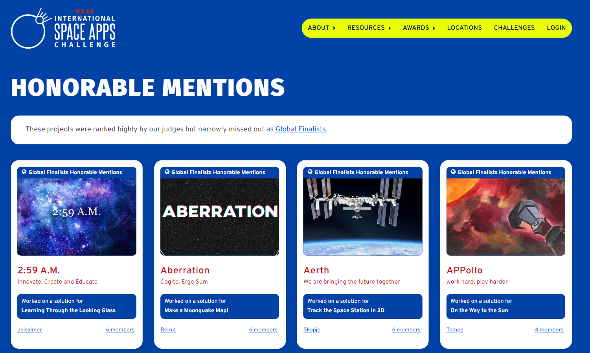

<!-- which  -->
# INTROSPECTOR - Gamified Webgl Quiz
 

KARA targets the Kids, using our AR and VR-driven content based on our current NEP-2020 policy we have created content that will change the future of learning in a most innovative manner.

Kara is a simple, engaging, and interactive learning App for kids, focusing on STEM-based learning using Extended Reality and Mixed reality. It works on the basis of creating a virtual world – real or fictional – that users can see and interact with.
## INSTRUCTIONS TO USE OUR PROJECT
-> Our project includes several AR models and andriod games. 
-> We have created seperate folder for each of them like- folder name AR, Android etc. 
-> Within AR folder, all seperate AR modules of our project are present and same for android. 
-> We have created seperate readme file for each of them which clearly provide the instructions to use the modules. 
## Demo
# [Project Link](https://thunderous-sherbet-80b45f.netlify.app/)

## Features
### AR Model - A VR model of the solar system which gives you an ultimate experience of the universe as you can watch various features of the solar system.

### AR Model - An AR model of the various parts of a human body. Helps remember the names better .

### AR Model - Playing with alphabets - This is a visual aid which helps in learning alphabets.

### Game (Pretty Mushroom) - It is a science trivia game which presents quiz as a way to win various coins.

## Contributors

- [Kapil Kumar Singh](https://github.com/kapilsingh2003)

## Accomplishments

**Event:**  [NASA Space Apps Challenge 2022](https://www.spaceappschallenge.org/)

**Position:**  [Global Finalist Honorable Mention](https://2022.spaceappschallenge.org/awards/honorable-mentions/)

## Lessons Learned :  - [Deploying Unity Projects on webgl pages.](https://youtu.be/q8R3IkbaDso/)

